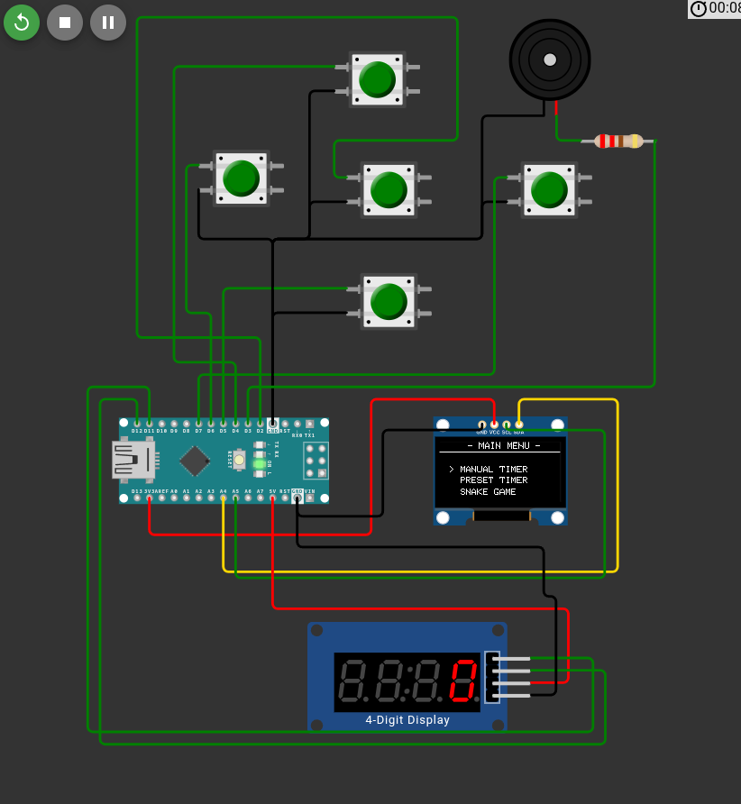
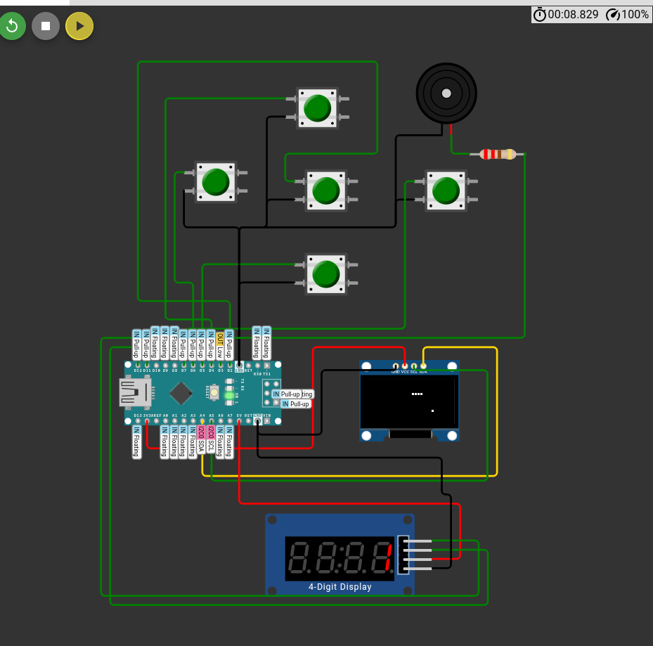
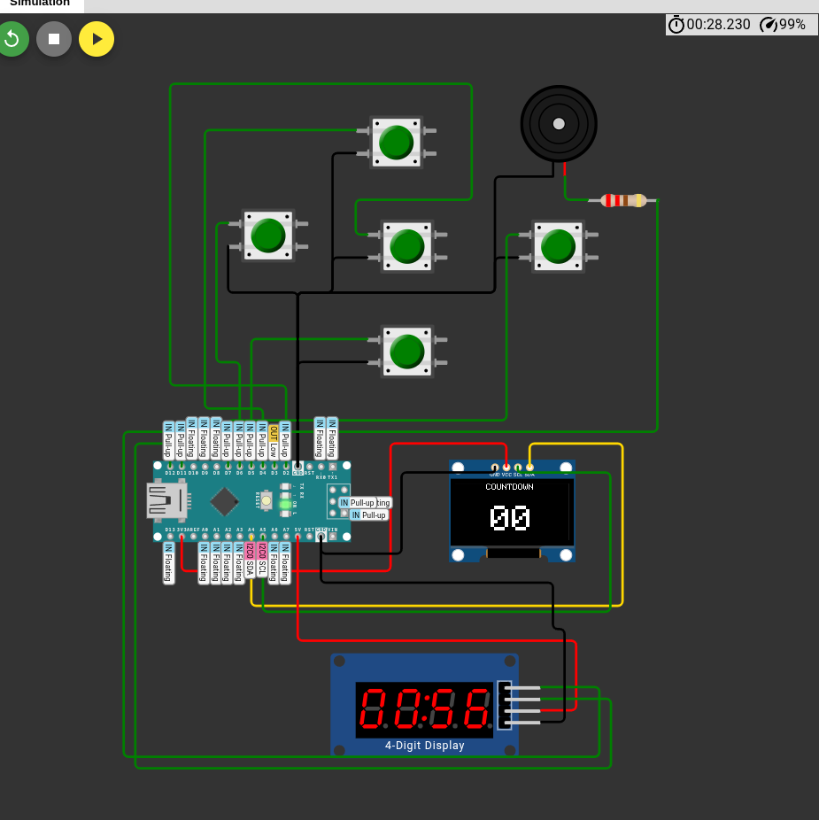

# 🐍 Sumbul OS v1.0 - Arduino Nano Console

A multi-functional mini-console project based on the Arduino Nano that combines a Countdown Timer (Manual & Preset) with the classic Snake game, inspired by the Nokia 3310. This device utilizes a dual-display setup for maximum visibility: an OLED for menus/game graphics and a 7-segment display for time and scores.

## 🖼️ Schmetics Circuit

## 🖼️ Snake Game

## 🖼️ Timer

## 🚀 FKey Features
Dual Display System:

0.96" I2C OLED: Displays the Main Menu, Game Graphics, and Status.

TM1637 7-Segment: Displays the Countdown timer (MM:SS) and Game Scores.

3 Operating Modes:

Manual Timer: Set a custom duration (Minutes & Seconds).

Preset Timer: Quick-start options for 1, 5, and 10 minutes.

Snake Game: Classic snake gameplay with high score saving.

Audio Feedback: Features a Nokia-style startup tune, in-game sound effects (eating), and a timer alarm using a Low-Level Trigger Buzzer.

High Score Persistence: The highest score is saved to the EEPROM, ensuring it remains even after the device is powered off.

## 🛠️ Components List
- Arduino Nano
- OLED 0.96" I2C (SSD1306)
- 7-Segment Display (TM1637)
- 5x Push Button (Navigasi: Up, Down, Left, Right, Select)
- Buzzer (Low Level Trigger - MH-FMD)
- Baterai Li-ion 3.7V + Modul Step-Up 5V (TP5400)

## 🔌 Wiring Diagram
| Komponen | Pin Arduino Nano |
| :--- | :--- |
| **OLED SDA/SCL** | A4 / A5 |
| **TM1637 CLK/DIO** | D11 / D12 |
| **Buzzer I/O** | D3 |
| **Button UP/DOWN** | D4 / D5 |
| **Button LEFT/RIGHT** | D6 / D7 |
| **Button SELECT** | D2 |

## 📦 Required Libraries
1. `Adafruit_SSD1306`
2. `Adafruit_GFX`
3. `TM1637Display`
4. `EEPROM` (Bawaan Arduino)
